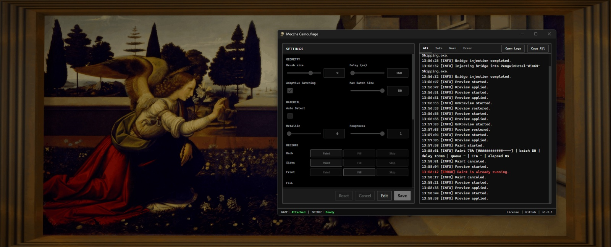

<p align="center">
  
</p>

<h1>
  
  Zemi Mecchamouflage
</h1>

A Windows desktop app for MECCHA CHAMELEON.

## Features

- **Paint**: Paint a player character with custom colors and materials.
- **Image Paint**: Paint imported images onto a player character.
- **ESP**: Show player locations and information in game.

## Download

Download the latest `zemi-mecchamouflage.exe` from GitHub Releases:

- https://github.com/Mozmina/MecchaCamouflage/releases/latest

## Usage

1. Start MECCHA CHAMELEON.
2. Start `zemi-mecchamouflage.exe`.
3. Confirm the target process and bridge state in the app.
4. Press the saved paint hotkey.

Logs are written under:

```text
%LOCALAPPDATA%\ZemiMecchamouflage\versions\<version>\logs\
```

If Windows asks, approve the UAC prompt at startup to add this Microsoft
Defender exclusion:

```text
%LOCALAPPDATA%\ZemiMecchamouflage\
```

After adding the exclusion, restart Zemi Mecchamouflage.

## Development

```bash
git clone --recurse-submodules https://github.com/Mozmina/MecchaCamouflage.git
cd MecchaCamouflage
make run
```

## Docs

- [Repository layout](docs/repository-layout.md)
- [Direct bridge injection](docs/runtime-direct-bridge.md)
- [Runtime maintenance](docs/runtime-maintenance.md)
- [Paint replication validation](docs/runtime-paint-replication-validation.md)
- [Research tools](docs/research-tools.md)
- [Release checklist](docs/release-checklist.md)

## Contributing

Pull requests welcome. See [CONTRIBUTING.md](CONTRIBUTING.md) for setup, code style, and the PR process. This fork is based on [acentrist/MecchaCamouflage](https://github.com/acentrist/MecchaCamouflage) — consider contributing improvements upstream too.

## Security

Follow the disclosure process in [SECURITY.md](SECURITY.md).

## License

[GPL-3.0-or-later](LICENSE.txt) © Acentrist
